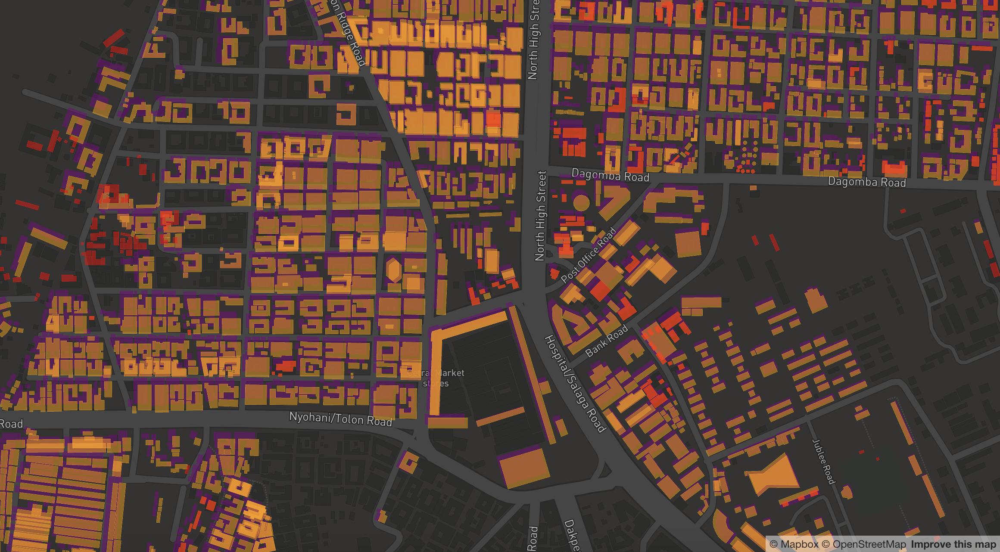

Interactions Builder
====================

Built atop the [`oshdb-api`](//github.com/GIScience/oshdb).

This java application reads an OSHDB and uses the `ContributionView` to create GeoJSON features that represent where and when an edit took place on the map.

The output can be piped directly into `tippecanoe` to create a tileset that can accurately represent concepts like minor versions and deletions: 



_Red objects have been deleted while the orange/purple objects represent minor geometry changes_. The metadata associated with each object represents the _interaction_ that took place: when, who, and what type of change it was.

Such as a deletion:
```javascript
{ "type":"Feature",
  "properties": { 
    "@edit":"DELETION",
    "@uid":9083841,
    "@deleted_uid":9083841,
    "@id":654205683,
    "@validSince":1544524619,
    "@validUntil":1547649686},
    "geometry":{"type":"Polygon","coordinates":[[[-0.0935087,10.8503375],[-0.09347599999999999,10.8503211],[-0.0934896,10.8502949],[-0.09352239999999998,10.8503113],[-0.0935087,10.8503375]]]}}
}
```

### Building a Tileset with `tippecanoe`
Once the geojson output is created, a tileset can`` be generated using [`tippecanoe`](github.com/mapbox/tippecanoe). 

To generate a zoom 14 level tileset from the `buildings.geojsonseq` file: 

    tippecanoe -Pf -Z14 -z14 -d18 -pf -pk -pg -ps -pD --output=interactions.mbtiles --layer=buildings buildings.geojsonseq
    
Depending on the machine being used and available resources, it might be worth changing the `tmp` directory by adding `-t /home/cc/data/tmp`

    tippecanoe -Pf -Z14 -z14 -d18 -pf -pk -pg -ps -pD --layer=interactions --output=se-asia-interactions.mbtiles buildings.geojsonseq